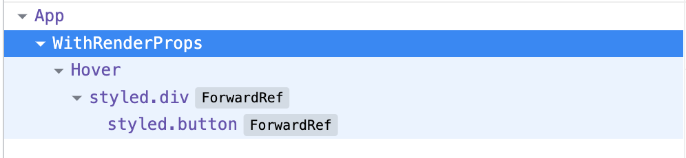
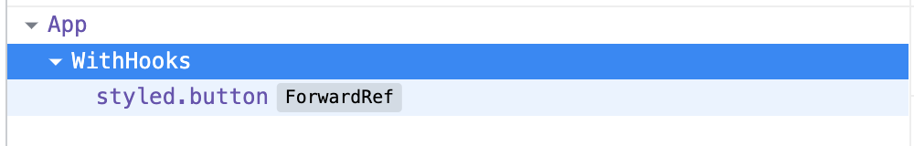

# Getting Started with React Patterns

## Table of Contents

- [Provider Pattern](#providerpattern)
- [Compound Components Pattern](#compoundpattern)
- [Custom hooks Pattern](#customhookspattern)

## <a name="providerpattern">Provider Pattern</a>

As you probably already know, React uses a unilateral data (props) flow from parent components to children's ones. This is called _prop drilling_. This can quickly become an issue when we pass down props to components located deep in the tree and unrelated components share this data along the way.
Let's imagine we have an `App` component that fetches data items. Lower on the tree, we have a `Card`, `List` and finally `ListItem` components.


Then we would need to pass down data items, useful only to `ListItem`, to multiple layers that don't need them. The bigger the application, the harder it can become to maintain and refactor.  
The **Provider Pattern** solves this problem by enabling us to store data in a globalized state, _React Context_, and directly share it to a selected component.

**Let's do a real code example.**

> All the source code is accessible on:
> https://github.com/emuraton/react-patterns/tree/main/src/patterns/provider

First, let's define a react context, this will serve us to save our global data.

```jsx
import * as React from 'react';

export const Context = React.createContext(null);
```

Then, let's create a button that will use a `themeColor` to define which color to use. By using the `useContext` hook, we can directly access any data saved in our react context.

```jsx
import { Context } from '../../context/index';

const ThemedButton = ({ children }) => {
  const contextValue = React.useContext(Context);

  return (
    <Button
      themeColor={contextValue.themeColor}
      onClick={contextValue.updateThemeColor}
    >
      {children}
    </Button>
  );
};

export default ThemedButton;
```

Now, we can use our `Context` and `ThemedButton`. The react provider uses a `value` prop, which is the data we want to pass down.

```jsx
import ThemedButton from './ThemedButton';
import { Context } from '../../context';

const THEME_COLOR = `primary`;

const Usage = () => {
  const [themeColor, setThemeColor] = React.useState(THEME_COLOR);

  const updateThemeColor = () => {
    setThemeColor(themeColor === `primary` ? `secondary` : `primary`);
  };

  return (
    <Context.Provider value={{ themeColor, updateThemeColor }}>
      <Card>
        <List>
          <ThemedButton>Btn</ThemedButton>
        </List>
      </Card>
    </Context.Provider>
  );
};
```

We don't need anymore to pass down props through each layer manually.  
Some of the most common use cases for the provider pattern are theming, i18n, authentication and logging.

## <a name="compoundpattern">Compound Coponents Pattern</a>

This one is my favourite pattern. Very often, you do write interdependent components that share states and handler logic. The compound component pattern helps you to create a group of components that all work together. It allows you to build more customizable components, with a flexible API.
Compound components manage their own internal state, which they share among the several child components. To share state, you have 2 ways. One with _React.cloneElement_ and the other with _React Context_.

**Example: Counter component**

> All the source code is accessible on:
> https://github.com/emuraton/react-patterns/tree/main/src/patterns/compound-components

```jsx
const MIN_VALUE = 0;
const MAX_VALUE = 20;

const Counter = ({ children }) => {
  const [quantity, setQuantity] = React.useState(0);

  const onIncrement = () => {
    if (quantity === MAX_VALUE) return;
    setQuantity(quantity + 1);
  };
  const onDecrement = () => {
    if (quantity === MIN_VALUE) return;
    setQuantity(quantity - 1);
  };

  // You can replace React.cloneElement by React Context if you fancy
  return (
    <Container>
      {React.Children.map(children, (child) =>
        React.cloneElement(child, { onIncrement, onDecrement, quantity })
      )}
    </Container>
  );
};
```

Then we can use it like this

```jsx
const Usage = () => {
  return (
    <Counter>
      <Counter.Decrement />
      <Counter.Quantity />
      <Counter.Increment />
    </Counter>
  );
};
```

This component has great UI flexibility and is extremely powerful when you want to implement multiple variants of a component. For example, the user can change the SubComponents’ order or define which one should be displayed.

## <a name="customhookspattern">Custom hooks Pattern</a>

First thing first; what are hooks?
From react documentation:

> Hooks are a new addition in React 16.8. They let you use state and other React features without writing a class.

But they are actually far more, because React allows you to build your own hooks.
If you want more information about hooks, you can dig in https://reactjs.org/docs/hooks-intro.html

Preciously you were probably using `HOC` or `Render props` patterns, which were good patterns, but could also be frequently quite frustrating to use. The most common issue is the "wrapper hell" (nesting of non rendering component).
Have you ever looked at your devtools and seen a component wrapped in a huge block of HOC / render props components? Most likely yes. This make debugging, testing and improving perfomance quite difficult.
But, here the cool part, as `Render props` / `HOC` patterns and `Custom hooks` both allow you to extract component's logic into reusable function, you can replace these pattern by custom hooks.

To make it simpler to understand, let's write the same functionality both with a render props and a custom hook. For instance, a simple onHover logic.

With `Render props`, we need to create a component that will handle this logic for its children.

```jsx
class Hover extends React.Component {
  constructor(props) {
    super(props);
    this.state = {
      hovered: false,
    };
  }

  handleMouseOver = () => this.setState({ hovered: true });
  handleMouseOut = () => this.setState({ hovered: false });

  render() {
    return (
      <Wrapper
        onMouseOver={this.handleMouseOver}
        onMouseOut={this.handleMouseOut}
      >
        {this.props.render(this.state)}
      </Wrapper>
    );
  }
}

const Wrapper = styled.div`
  // some css
`;
```

And then wrap our UI component, with `Hover`.

```jsx
const WithRenderProps = () => (
  <Hover
    render={({ hovered }) => <Button hovered={hovered}>Im a button</Button>}
  />
);
```

With the `Custom hooks` pattern, we will create a separate function that will handle the logic and then use it directly into our UI component.

```jsx
const useHover = () => {
  const [hovered, setHovered] = useState(false);
  const ref = useRef(null);

  const handleMouseOver = () => setHovered(true);
  const handleMouseOut = () => setHovered(false);

  useEffect(() => {
    const node = ref.current;
    if (node) {
      node.addEventListener('mouseover', handleMouseOver);
      node.addEventListener('mouseout', handleMouseOut);
      return () => {
        node.removeEventListener('mouseover', handleMouseOver);
        node.removeEventListener('mouseout', handleMouseOut);
      };
    }
  }, [ref.current]);

  return [ref, hovered];
};
```

```jsx
const WithHooks = () => {
  const [btnRef, hovered] = useHover();

  return (
    <Button ref={btnRef} hovered={hovered}>
      Im a button
    </Button>
  );
};
```

Now let's compare the result in the devtools.

<p align="center">
  
  
</p>

As you can see, the second one with custom hooks is far more readable and concise.
